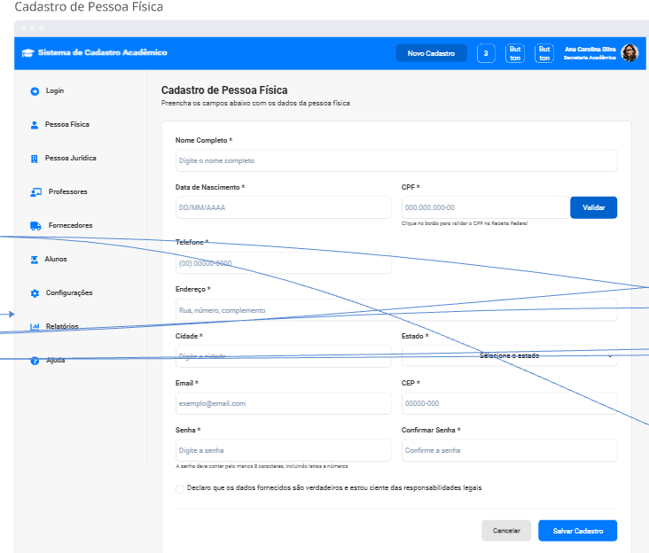

# PROJETO INTEGRADOR: DESENVOLVIMENTO DE SISTEMAS ORIENTADO A OBJETOS

O projeto tem como objetivo modelar, documentar e prototipar um sistema de cadastro acadêmico para pessoas físicas, jurídicas, alunos, professores e fornecedores, utilizando princípios de orientação a objetos. Na Fase 1, foram elaborados os diagramas UML e a descrição detalhada dos cenários de uso, definindo os requisitos do sistema. Já na Fase 2, foram desenvolvidos os protótipos funcionais das jornadas de cadastro e organizado o repositório GitHub com a documentação e materiais do projeto.


## Integrantes
- Mariana Caroline José de Deus
- Mateus de Amorim Gouvêa
- Lucas Noffs Motta


---

## Visão Geral da Fase 1
Nesta fase foram desenvolvidos:
- Diagrama de caso de uso
- Descrição detalhada dos cenários dos casos de uso
- Diagrama de classes


---

## Visão Geral da Fase 2
Nesta fase foram desenvolvidos:
 - Protótipos funcionais das principais jornadas do sistema, incluindo os cadastros de Pessoa Física, Pessoa Jurídica, Alunos, Professores e Fornecedores. 
 - Organização colaborativa do repositório no GitHub, com a criação do README.md, inclusão dos protótipos da interface, anexação dos diagramas produzidos na Fase 1 e inserção da modelagem física do banco de dados (SQL). Esta etapa consolidou a documentação e preparou a base visual e estrutural para o desenvolvimento do sistema.


---

## Protótipos da Fase 2

Nesta fase foram desenvolvidos protótipos funcionais representando as jornadas principais do sistema, com base nos diagramas elaborados na Fase 1.

### Cadastro de Pessoa Física


### Cadastro de Pessoa Jurídica


### Cadastro de Alunos


### Cadastro de Professores


### Cadastro de Fornecedores


### Visão Geral do Sistema


### Protótipo funcional no Miro
[Link para o protótipo no Miro](https://miro.com/app/board/uXjVJr7Oxy0=/)

---

## Estrutura do Repositório
- `/diagramas` — contém os diagramas UML da Fase 1 (caso de uso e classes)
- `/imagens` — contém os protótipos desenvolvidos na Fase 2
- `/sql` — contém o arquivo `create_tables.sql` com a modelagem física (SQL)
- `README.md` — documentação completa do projeto


---

## Diagrama de Caso de Uso


---

## Descrição dos Cenários dos Casos de Uso

Os cenários de uso detalham o comportamento esperado do sistema em cada operação de cadastro, incluindo pré-condições, fluxo principal, fluxos alternativos e pós-condições. A seguir, um resumo dos principais cenários modelados:

### Cadastro de Pessoa Física
- **Pré-condição:** usuário autenticado.  
- **Fluxo principal:** secretaria acessa a função de cadastro, insere nome, CPF, endereço e telefone; sistema valida e grava os dados.  
- **Fluxos alternativos:** CPF inválido ou já cadastrado.  
- **Pós-condição:** pessoa física registrada e disponível para consulta.

### Cadastro de Pessoa Jurídica
- **Pré-condição:** usuário autenticado.  
- **Fluxo principal:** secretaria informa razão social, CNPJ, endereço e telefone; sistema valida e registra.  
- **Alternativas:** CNPJ inválido ou duplicado.  
- **Pós-condição:** pessoa jurídica cadastrada e pronta para associações.

### Cadastro de Aluno
- **Pré-condição:** usuário autenticado.  
- **Fluxo principal:** dados pessoais e acadêmicos são informados; sistema valida e salva.  
- **Alternativas:** CPF inválido ou matrícula duplicada.  
- **Pós-condição:** aluno registrado no sistema.

### Cadastro de Professor
- **Fluxo principal:** inserção de dados pessoais e acadêmicos; validação e gravação.  
- **Alternativas:** CPF inválido ou repetido.  
- **Pós-condição:** professor apto para associação a disciplinas.

### Cadastro de Fornecedor
- **Fluxo principal:** dados básicos informados; sistema valida CPF/CNPJ.  
- **Alternativas:** inconsistências nos documentos.  
- **Pós-condição:** fornecedor registrado para futuras transações.


---

## Diagrama de Classes

O diagrama de classes representa a estrutura estática do sistema, incluindo classes, atributos, métodos, herança e associações. Ele define a organização entre Pessoa, PessoaFisica, PessoaJuridica, Aluno, Professor, Fornecedor, Curso e Departamento.


---

## Referências Bibliográficas

BOOCH, G.; RUMBAUGH, J.; JACOBSON, I. *UML: Guia do Usuário*. Rio de Janeiro: Elsevier, 2005.  
LARMAN, C. *Utilizando UML e Padrões*. Porto Alegre: Bookman, 2000.  
PRESSMAN, R. S. *Engenharia de Software: Uma Abordagem Profissional*. AMGH, 2011.

---

## Modelagem Física (SQL)

```sql
CREATE TABLE Pessoa (
    id INT PRIMARY KEY AUTO_INCREMENT,
    nome VARCHAR(100) NOT NULL,
    email VARCHAR(100),
    endereco VARCHAR(150),
    telefone VARCHAR(20)
);

CREATE TABLE PessoaFisica (
    pessoaId INT PRIMARY KEY,
    cpf VARCHAR(11) UNIQUE NOT NULL,
    dataNascimento DATE,
    rg VARCHAR(20),
    FOREIGN KEY (pessoaId) REFERENCES Pessoa(id)
);

CREATE TABLE PessoaJuridica (
    pessoaId INT PRIMARY KEY,
    cnpj VARCHAR(14) UNIQUE NOT NULL,
    razaoSocial VARCHAR(120),
    nomeFantasia VARCHAR(120),
    FOREIGN KEY (pessoaId) REFERENCES Pessoa(id)
);

CREATE TABLE Aluno (
    pessoaId INT PRIMARY KEY,
    matricula VARCHAR(20) UNIQUE NOT NULL,
    dataIngresso DATE,
    statusAcademico VARCHAR(30),
    FOREIGN KEY (pessoaId) REFERENCES Pessoa(id)
);

CREATE TABLE Professor (
    pessoaId INT PRIMARY KEY,
    siape VARCHAR(20) UNIQUE NOT NULL,
    titulacao VARCHAR(50),
    areaAtuacao VARCHAR(100),
    departamentoId INT,
    FOREIGN KEY (pessoaId) REFERENCES Pessoa(id),
    FOREIGN KEY (departamentoId) REFERENCES Departamento(id)
);

CREATE TABLE Departamento (
    id INT PRIMARY KEY AUTO_INCREMENT,
    codigo VARCHAR(10) UNIQUE NOT NULL,
    nome VARCHAR(100),
    sigla VARCHAR(10)
);

CREATE TABLE Curso (
    id INT PRIMARY KEY AUTO_INCREMENT,
    codigo VARCHAR(10),
    nome VARCHAR(100),
    cargaHoraria INT
);

CREATE TABLE Fornecedor (
    id INT PRIMARY KEY AUTO_INCREMENT,
    codigoFornecedor VARCHAR(20),
    tipoFornecedor VARCHAR(50),
    servicosPrestados VARCHAR(200)
);


CREATE TABLE AlunoCurso (
    alunoId INT,
    cursoId INT,
    PRIMARY KEY (alunoId, cursoId),
    FOREIGN KEY (alunoId) REFERENCES Aluno(pessoaId),
    FOREIGN KEY (cursoId) REFERENCES Curso(id)
);

CREATE TABLE ProfessorCurso (
    professorId INT,
    cursoId INT,
    PRIMARY KEY (professorId, cursoId),
    FOREIGN KEY (professorId) REFERENCES Professor(pessoaId),
    FOREIGN KEY (cursoId) REFERENCES Curso(id)
);
